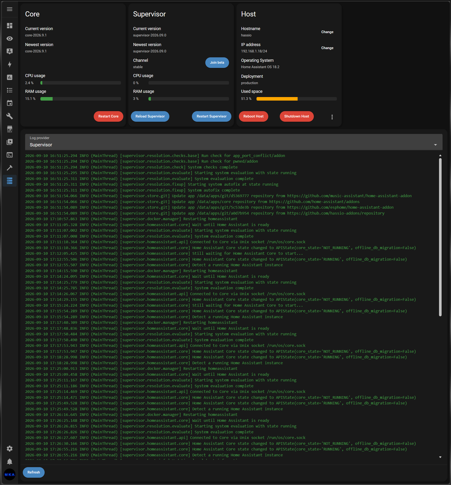

# Server Controls

Brings back the **Server Controls** page that was removed from Home Assistant in 2026.5.

## What it does

Adds a **Server Controls** item to the sidebar for Home Assistant admin users. This integration is a port of the last released version of `/hassio/system`. It talks to the same Supervisor API, so it works the way the original did:

- **Core** - version, CPU / RAM usage, Restart, hostname change
- **Supervisor** - version, CPU / RAM usage, Reload, beta channel toggle
- **Host** - OS version, IP, disk usage, Reboot, Shutdown, Hardware list, Import from USB, Move data disk
- **Log viewer** - color log output, with provider selection when Advanced mode is enabled

## Requirements

- Home Assistant OS or Supervised (needs the Supervisor)
- Home Assistant 2026.5 or newer

## Installation

### HACS (recommended)

1. Open HACS and go to **Integrations**.
2. Open the menu in the top right corner of the HACS page and select **Custom repositories**.
3. Add `https://github.com/MKANET/ha-server-controls` with category **Integration**.
4. Search for **Server Controls** and download it.
5. Restart Home Assistant.

### Manual

1. Copy `custom_components/server_controls` into your `config/custom_components` directory.
2. Restart Home Assistant.

## Setup

Go to **Settings > Devices & services > Add integration**, search for **Server Controls**, and add it. There isn't anything to configure. The sidebar entry appears right away and is removed when you delete the integration.

No `configuration.yaml` changes are needed.

## Notes

- The page is only visible to admin users, just like the original.
- The log provider dropdown is shown when **Advanced mode** is enabled in your user profile.
- Network configuration is not part of the page. Use `ha network` from the CLI.

## Credits

Adapted from the `hassio/src/system` sources in [home-assistant/frontend](https://github.com/home-assistant/frontend). See [NOTICE](NOTICE) for bundled third-party components.
